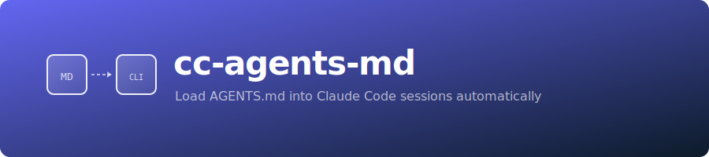

<p align="center">
  
</p>

<p align="center">
  <a href="https://github.com/GeiserX/cc-agents-md/actions/workflows/ci.yml"></a>
  <a href="https://www.npmjs.com/package/cc-agents-md"></a>
  <a href="https://www.gnu.org/licenses/gpl-3.0"></a>
</p>

Claude Code only reads `CLAUDE.md`. The [AGENTS.md specification](https://agents.md) is supported by 23+ tools (Codex, Cursor, Copilot, Gemini CLI, and more), but Claude Code is not one of them. This has been the [most requested feature](https://github.com/anthropics/claude-code/issues/6235) (3,600+ upvotes) with no official response.

**cc-agents-md** fixes this. One command, and every Claude Code session automatically loads your AGENTS.md files. No CLAUDE.md wrapper files. No symlinks. No patches.

## How It Works

A `SessionStart` hook is registered in `~/.claude/settings.json`. On every new Claude Code session, the hook:

1. Walks **upward** from your working directory to the git root
2. Collects every `AGENTS.md` on the path
3. Small files are **inlined** directly into Claude's context
4. Large files get a **preview + read instruction** — Claude reads the full file on demand

```text
monorepo/
├── AGENTS.md                  ← always loaded (project root)
├── packages/
│   ├── frontend/
│   │   ├── AGENTS.md          ← loaded if you're working here
│   │   └── src/
│   └── backend/
│       ├── AGENTS.md          ← NOT loaded (not on your path)
│       └── src/
```

The depth adapts to where you are. Open Claude at the root? One file. Open it in `packages/frontend`? Two files. No scanning downward, no wasted context.

## Installation

```bash
npx cc-agents-md setup
```

That's it. Restart Claude Code.

### Verify

```bash
npx cc-agents-md doctor
```

### Uninstall

```bash
npx cc-agents-md remove
```

## Commands

| Command   | Description                                      |
|-----------|--------------------------------------------------|
| `setup`   | Install the SessionStart hook globally            |
| `remove`  | Uninstall completely (hook + script)              |
| `status`  | Show installation state and detected AGENTS.md    |
| `doctor`  | Full health check                                 |
| `preview` | Print exactly what Claude would see               |

## Configuration

### Inline threshold

Files under 200 lines are inlined fully. Larger files get a read instruction — Claude reads the full file on demand. Customize:

```bash
export AGENTS_MD_INLINE_THRESHOLD=200   # lines — inline below, read instruction above
```

## How is this different from...

### `@AGENTS.md` in CLAUDE.md

That still requires a CLAUDE.md file in every repo. Also, [imported content is followed less reliably](https://github.com/anthropics/claude-code/issues/35295) than inline instructions.

### Symlink `CLAUDE.md → AGENTS.md`

Still creates a CLAUDE.md file (even if it's a symlink). Doesn't handle nested AGENTS.md in monorepos.

### `tweakcc`

Patches Claude Code's JavaScript internals. Breaks on every update. This tool uses the stable, documented hook API.

## Requirements

- Claude Code (any version with SessionStart hooks)
- Node.js >= 18 (for the CLI only — the runtime hook is pure bash)
- bash (pre-installed on macOS and Linux)

## License

GPL-3.0 — see [LICENSE](LICENSE).
